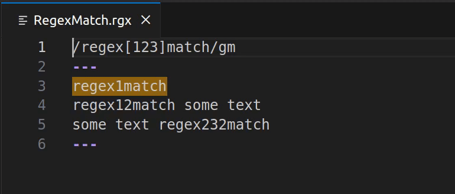
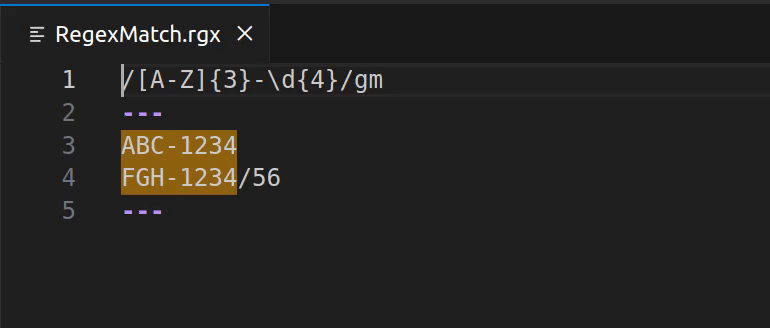

# Regex Match

[Regex Match](https://marketplace.visualstudio.com/items?itemName=pedrohenrique-ql.regex-match) is a Visual Studio Code extension that enables dynamically creating, testing and debugging regular expressions within a text file. It provides a simple and user-friendly interface, making the process of working with regular expressions effortless and efficient.

Press `Ctrl+Alt+X`/`Cmd+Alt+X` or use the command `Regex Match: Open Regex Match Window` to open the regex test window, where you can test your regular expressions with the help of highlights.


## Table of Contents

- [Features](#features)
- [Release Notes](#release-notes)
- [Development](#development)
  - [Requirements](#requirements)
  - [Usage](#usage)
  - [Testing](#testing)

## Features

### Test Regular Expressions

Create, test and debug your regex in a text window. To do this, use the standard format with the regex on the first line of the file with the flags required for your case, plus the test string between the text area delimiters (`---`).



### Highlight of Capturing Groups

Each group in a regular expression is highlighted in a different color, making it easy to distinguish and identify them. Color-coded regex capture groups enhance readability and simplify debugging.



## Release Notes

### 0.2.0

- Highlight capturing groups in the test string.
- Use diagnostics to show errors in the regex match window.
- Prevents the extension from acting on non-extension files.

### 0.1.0

- Create, test and debug regular expressions within a text file.
- Highlight matches in the text.
- Use `Ctrl+Alt+X`/`Cmd+Alt+X` to open the regex match window.

## Development

### Requirements

- [Node.js v.20.11.0](https://nodejs.org/)
- [Visual Studio Code v1.87.0](https://code.visualstudio.com/)
- [pnpm v8.15.3](https://pnpm.io/)

### Usage

1. Install the dependencies:

   ```bash
   pnpm install
   ```

2. Build the extension:

   ```bash
   pnpm compile
   ```

3. Press `F5` to open a new window with the extension loaded.
4. Press `Ctrl+Alt+X`/`Cmd+Alt+X` to open the regex match window.

### Testing

To run the interface tests, run the following command:

```
pnpm test:vsc
```

To run the unit tests, run the following command:

```
pnpm test:vi
```
